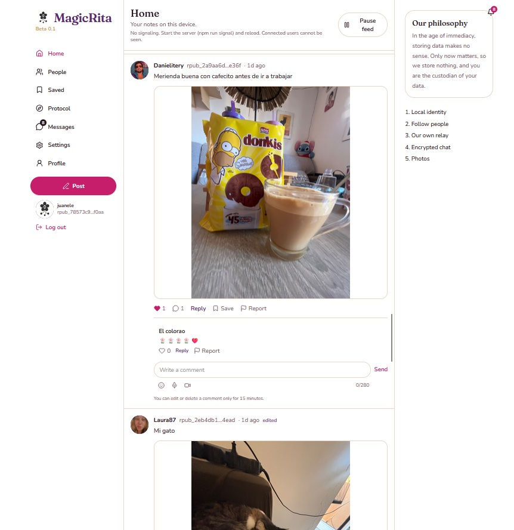
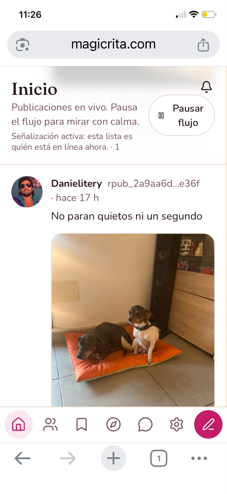

# MagicRita

MagicRita is a **local-first social network with its own protocol**. It is not a Nostr, Mastodon, ActivityPub, or Farcaster client. Identity, posts, media, and chat are MagicRita envelopes (`rpub` / `rsec` + Ed25519 signatures). Protocol detail lives in `docs/PROTOCOLO.md`.

The product is **100% decentralized for social data**. There is no account server, no post database, and no cloud that owns your life. Your identity, notes, photos, audio, video, follows, and encrypted chat live on **your device**. When someone else is online, envelopes travel **peer to peer** over WebRTC. The only shared machine is a **signaling relay**: it introduces browsers that are connected *right now*. It does not store posts, profiles, or secret keys. A RAM mailbox for a briefly absent peer is wiped when the process restarts.

You are the owner and custodian of your information. If you lose the secret key (`rsec`), nobody can recover the account. MagicRita does not sell data, does not set tracking cookies, and does not run a ranking engine.

MagicRita **does not use email for anything**. There is no signup by mail, no verification mail, no password reset, and no notifications by mail. The app **neither sends nor receives email**. Identity is the key on your device, not an inbox.

### Examples

**Computer**



**Phone**



### No control algorithm

The home feed is not ranked. There is **no popularity score**, no “for you” layer, and **no boost for accounts with more likes, followers, or reach**. MagicRita does not favor the most popular people. A note from someone you just met is shown the same way as a note from anyone else, as long as it passes local anti-spam checks (young untrusted keys can be quarantined; that is a filter, not a ranking).

Posts appear **in the order they arrive and were signed**: newest timestamp first (`ts` on the envelope). When a peer sends a note, it shows up in the live feed. There is no engagement-based reorder, no hold-back of “low performing” posts, and no paid placement.

### Cryptography

| Layer | What it does |
| --- | --- |
| **Identity** | Ed25519 key pair. Public id `rpub_` + 64 hex. Secret `rsec_` + 64 hex. The relay never holds `rsec`. |
| **Envelopes** | Every profile, post, follow, block, like, comment, report, invite, delete, and chat event is signed Ed25519 over canonical JSON of `v`, `type`, `author`, `ts`, `body`. Remote events are verified before they are stored. |
| **Vault** | The secret is wrapped in the browser with **scrypt** (`N = 2¹⁵`, `r = 8`, `p = 1`, 32-byte key) and **XChaCha20-Poly1305**. Unlocking needs your password on this device. |
| **Chat** | End-to-end. Ed25519 keys are converted to Montgomery form; **X25519** ECDH produces a shared secret, hashed with **SHA-256**, then **XChaCha20-Poly1305** (24-byte nonce) seals the text. The relay forwards a signed box it cannot read. |
| **Media** | Photos, voice, and video are hashed with **SHA-256**. The hash sits in the envelope; the bytes stay in IndexedDB and move P2P. The relay does not keep the files. |
| **Hello / anti-spam** | WebSocket `hello` carries a SHA-256 proof of work (`rita-pow-v1:rpub:nonce`, 16 bits). Rate limits are in RAM per IP and per `rpub`. |

Libraries `@noble/curves`, `@noble/ciphers`, and `@noble/hashes` are **math only**. They are not a social network.

### Automatic deletion

MagicRita is built so that **old data leaves the device by itself**. There is no infinite server history.

- At most **100 posts** per author in this browser. Publishing another one drops the oldest, including its photo, audio, or video.
- At most **100 chats** on this device. When another conversation arrives, the one that has gone longest without a message is removed, including its media. Each chat also keeps at most **100 messages**; older lines are pruned.
- If localStorage or IndexedDB hits quota, the client frees the **oldest 25%** of posts and chat events for known authors, including media, and emits signed `delete` envelopes so others hide those targets too.
- Saved posts that point at a deleted note disappear from Saved.
- Explicit `delete` / `gone` envelopes hide the target everywhere this browser knows about.
- You may **edit a post or comment for 15 minutes**; after that you can only delete.
- The relay’s RAM mailbox is **empty after a restart**. It is not a backup.

Limits that travel with content: **280 characters** per post, comment, and chat line; **50** for the display name; **160** for the bio; **one photo** per note (JPEG, PNG, WEBP, or GIF, 8 MB); **voice up to 30 s**; **video up to 10 s** (8 MB).

---

## Contact

Try it on our demo. Request a tester invitation at the address below (a human reads that inbox; MagicRita itself never sends or receives email).

**Demo:** [https://magicrita.com](https://magicrita.com)

**Email:** [magicrita.beta@gmail.com](mailto:magicrita.beta@gmail.com)

---

## Contribute

You can help in two ways:

**Code.** Open an issue or a pull request. Keep the protocol local-first: no account server, and no post store on the relay.

**Donate.** MagicRita is free software (no charge to run it). Support development on [Ko-fi](https://ko-fi.com/magicrita). For other questions, write to [magicrita.beta@gmail.com](mailto:magicrita.beta@gmail.com).

---

## License

Copyright (C) 2026 jschaves.

MagicRita is free software under the [GNU Affero General Public License v3.0 or later](LICENSE). You may run, study, share, and change it.

If you run a modified MagicRita as a network service (your own relay or demo), AGPL requires you to offer that modified source to the people who use it.

There is no warranty. See `LICENSE` for the full terms.

---

## What is built (all five protocol steps)

1. **Local identity** — Create or import an Ed25519 identity. The `rsec` is encrypted in the browser vault. Profile and notes are signed and stored only on this device.
2. **Portable account** — Export a `magicrita-bundle` (encrypted identity, notes, and media) and import it in another browser or device. The file is *your* copy; it does not open someone else’s session. Signatures and media hashes are verified on import.
3. **Own relay** — Signaling WebRTC, live peer list, and an in-RAM mailbox. No notes, profiles, or keys on disk. Incremental join/leave (no full roster + avatar blast). Client re-sends `hello` about every 25 s so a restored session re-registers.
4. **Encrypted chat** — Request, accept, revoke, or block on either side. Messages send only when both latest `chat_consent` events are on. Block also turns consent off. 280 characters per line; 100 chats on this device and 100 lines kept per conversation.
5. **Media** — Signed SHA-256 refs in the envelope. One photo per note. Voice (WAV, 16 kHz mono) and video (file or camera, auto-stop at 10 s) in posts and chat. Files travel between peers and in the portable export; the relay does not store them.

The in-app protocol page and the sidebar philosophy copy mark these steps done. A persistent federated history store is **not** in scope: it would contradict “we do not store your life on a server.”

---

## Product surface

- **Welcome** — Pitch, how the relay works, encrypted chat, and posts. Locale from the browser or Ajustes / Settings (English, Spanish, Portuguese, French, Arabic, Russian, Chinese, Japanese). Arabic is RTL. Notes you write are not auto-translated.
- **Feed** — Live notes as they arrive, newest first. Pause/resume. Young untrusted keys stay out of home until followed, invited, or older than 12 hours (live peers skip that quarantine).
- **Publish** — Text, optional photo, optional voice, optional video. Media-only notes are allowed.
- **Comments** — 280 characters, emoji picker, voice, same report/hide rules as notes.
- **People** — Who is online now, follows, signed 7-day invites (`invite` envelope). New chats start from People or a profile, not by pasting an `rpub` in Messages.
- **Messages** — Only conversations that already have lines, plus an inbox of chat requests. Request / accept / revoke / block stay on the thread.
- **Notices** — Last 10 locally (chat, request, invite). Viewing the thread dismisses them. New chat plays a short beep. Messages shows a numeric badge.
- **Saved** — Local list of post signatures; deleted targets are dropped.
- **Settings** — Language, export/import, logout. Signal URL is **not** chosen in the UI; it is fixed at build (`VITE_SIGNAL_URL` or same-host `/signal/`).
- **Legal** — `/legal` (beta notes, 16+, Germany/EU relay, no tracking cookies).
- **Admin** — Spanish panel at `RUTA_ADMINISTRACION` (default `/topogue`). Login, live peers, user/comment blocks, site logo. API under `/admin-api/` with a bearer token in `sessionStorage` (no cookies).

Beta **0.1** is shown under the site mark. Optional `BETA_INVITE` in `.env` gates signup, import, unlock, and WebSocket `hello`. Empty means open access. Loopback (`127.0.0.1`) skips the invite so local `http://localhost:5173/` still works.

One identity per browser. Two accounts need two browsers (or a window plus incognito), both online together for WebRTC.

Microphone and camera need a **secure context**: `https://` or `http://localhost` / `127.0.0.1`, not a LAN IP such as `http://192.168.x.x`.

---

## Anti-spam (no user database)

Spam cannot be “banned at the protocol” the way a company account can. Defenses are local and in-RAM:

- Proof of work on `hello`.
- Per-IP and per-`rpub` rate limits on the relay (sockets, hellos, messages, mailbox). Not persisted.
- Signed invites (7 days). Follows and unexpired invites make an author trusted.
- Young keys: hidden from home/comments until trusted or 12 h old; 3 reports hide them (10 reports for others).
- At most two links per note or comment; repeated identical text is dropped.
- Client-side signup guard: one local account per browser, create-rate limit, local canvas captcha (no Google, no phone, no email, no KYC). The app does not send or receive mail.
- Admin panel can block an `rpub` for this operator’s relay; that is moderation of the signaling node, not a global kill switch for the key.

---

## Stack

| Piece | Choice |
| --- | --- |
| App | Vite 7, React 19, TypeScript, Tailwind 4 |
| Crypto | `@noble/curves`, `@noble/ciphers`, `@noble/hashes` |
| Relay | `server/signal.mjs` (Node, `ws`), RAM only |
| Local store | `localStorage` (logs, vault, locale), IndexedDB (media) |
| Transport | WebSocket signaling + WebRTC mesh |
| Production web | Static `dist/` behind nginx; the signaler does **not** serve the SPA |

Scripts: `npm run dev` (Vite on port 5173, auto-spawns the signaler), `npm run signal`, `npm run build` (`tsc -b && vite build`), `npm run preview`. Node **18+**.

The app **does not set cookies**. The signaler does not send `Set-Cookie`.

---

## Requirements on any machine

- **Git**
- **Node.js 18 or newer** (includes `npm`)
- Access to the private GitHub repository

```bash
git --version
node --version
npm --version
```

## Clone

**HTTPS** (GitHub will ask for a user and a Personal Access Token with `repo` scope, not the account password):

```bash
git clone https://github.com/jschaves/magicrita.git
cd magicrita
```

**SSH** (if a key is added on GitHub):

```bash
git clone git@github.com:jschaves/magicrita.git
cd magicrita
```

## Environment

`.env` is **not** in Git. On each new machine:

```bash
cp .env.example .env
```

Windows (PowerShell):

```powershell
Copy-Item .env.example .env
```

| Variable | Use |
| --- | --- |
| `ADMIN_USER` | Admin panel user |
| `ADMIN_PASSWORD` | Admin panel password |
| `RUTA_ADMINISTRACION` | Admin URL path (default `topogue`). Restart `npm run dev`; production needs a rebuild |
| `BETA_INVITE` | Closed-beta code. Empty = anyone can enter |
| `PORT` | Signaler port (default `8787`) |
| `HOST` | Signaler bind address (default `0.0.0.0`; production must be `127.0.0.1` behind nginx) |
| `VITE_SIGNAL_URL` | Only when **building** for production if signaling is not on the same host (example `wss://magicrita.com/signal/`) |

`node_modules/`, `dist/`, and `data/` are also local. `data/` holds admin blocks and the uploaded logo.

## Local development

```bash
npm ci
npm run dev
```

If `npm ci` fails (for example after a manual dependency edit), use `npm install`.

Open **http://localhost:5173/** (prefer localhost over a LAN IP so the mic, camera, and beta loopback bypass work). The signaler starts on port `8787`. The admin panel is `http://localhost:5173/` plus `RUTA_ADMINISTRACION` (default `/topogue`).

Stop with Ctrl+C. After relay or `.env` changes, restart `npm run dev` so `signal.mjs` reloads.

## Production (Linux VPS)

The public site is static files. `git pull` alone does **not** update what people see; you must build.

1. Clone (section above) and enter the directory.
2. Install dependencies and create `.env` (admin credentials, `HOST=127.0.0.1`, optional `BETA_INVITE`).
3. Build. Same-host signaling needs no `VITE_SIGNAL_URL`:

```bash
npm ci
npm run build
```

If signaling is on another host:

```bash
VITE_SIGNAL_URL=wss://your-domain/signal/ npm run build
```

4. Run the signaler and serve `dist/` with nginx. Step-by-step Ubuntu: `docs/INSTALAR-VPS.md`. Relay, nginx, and systemd: `docs/VPS.md`.

Typical layout: nginx on 80/443, `root` = `dist/`, proxy `/signal/`, `/admin-api/`, `/moderation/`, `/beta`, `/brand` to `127.0.0.1:8787`. Firewall only 22/80/443. After build, `chmod` so `www-data` can read `dist`.

```bash
npm run signal
```

The signaler does not serve the web UI.

Preferred hosting for the beta: a small VPS in **Germany (EU)** so the relay stays in the EU. Scale is concurrent WebSockets, not account count (there is no user table).

## What is in Git and what is not

| In the repository | Only on each machine |
| --- | --- |
| Code (`src/`, `server/`, `docs/`) | `node_modules/` |
| `package.json` and `package-lock.json` | `dist/` (`npm run build` output) |
| `LICENSE`, `.env.example` | `.env` (secrets) |
| | `data/` (admin blocks and logo) |

## Further documentation

- `docs/PROTOCOLO.md` — envelope format, identity, anti-spam
- `docs/VPS.md` — relay, nginx, systemd
- `docs/INSTALAR-VPS.md` — numbered install on a clean Ubuntu VPS
- `LICENSE` — GNU Affero GPL v3
